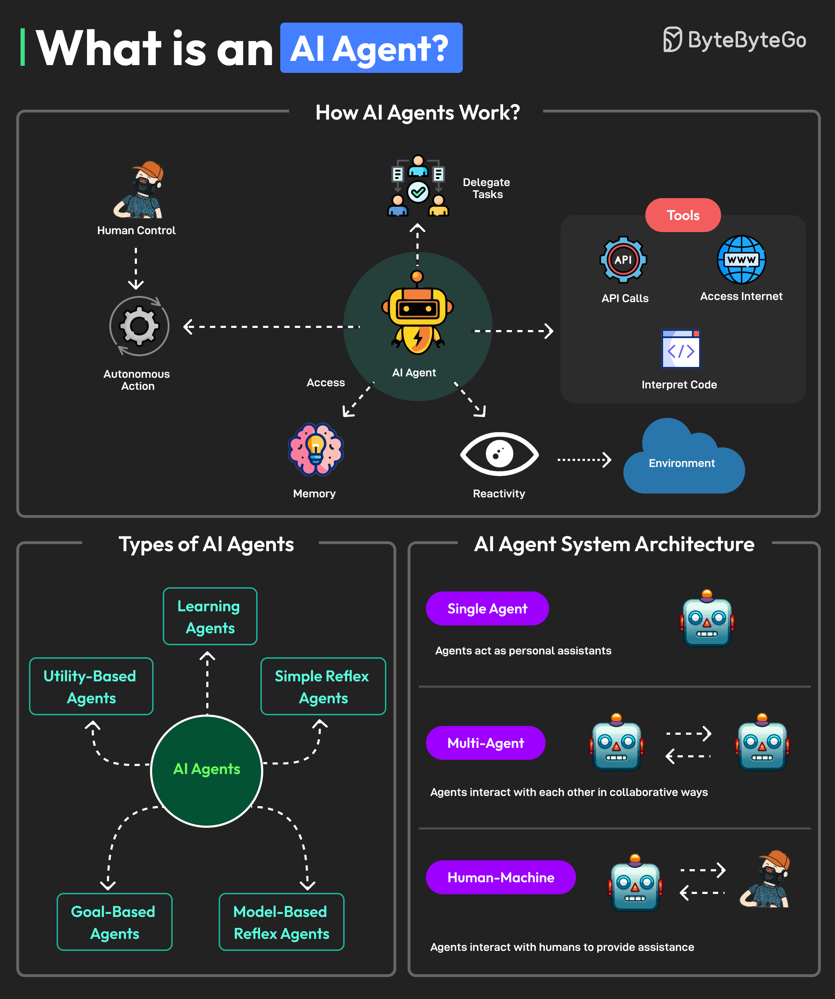

# Agent AI with Python – Simple Project Setup Guide (Using `uv`)

## What is Agent AI?

Agent AI means a computer program that can look at information, make decisions, and do things to reach a goal. Sometimes, it can also learn from what happens. You can find Agent AI in things like:

- Virtual assistants (like ChatGPT)
- Automation tools
- Smart search systems
- Robots
- AI customer support

This guide will help you:

1. Understand what Agent AI is
2. Learn about the main parts that make up an Agent AI
3. Set up a Python project using `uv`, a fast tool for managing Python packages

---

## What Does an AI Agent Do?

An AI Agent is a program that:

- Looks at its surroundings or gets some data (input)
- Decides what to do next (thinking or planning)
- Does something to change things (output)
- Sometimes learns from what happens to do better next time

### Types of Agents:

| Type                  | Description                                             |
|-----------------------|---------------------------------------------------------|
| Simple Reflex Agent   | Acts on current input only                              |
| Model-based Agent     | Uses internal state/memory to make better decisions     |
| Goal-based Agent      | Selects actions based on goals                          |
| Learning Agent        | Improves performance over time with data or feedback    |

---

## Main Parts of an Agent AI System

| Part           | What it means                                              |
|----------------|-----------------------------------------------------------|
| Environment    | The world or situation the agent is in                    |
| Perception     | What the agent knows or senses about the environment      |
| Action         | What the agent does to change things                      |
| Reasoning      | How the agent decides what to do (rules, learning, etc.)  |
| Memory         | What the agent remembers to help make better decisions    |
| Tools          | Extra things the agent can use (like web search or APIs)  |

---

## How to Set Up Your Project Using `uv`

[`uv`](https://github.com/astral-sh/uv) is a tool that helps you install Python packages and set up your project quickly. It is faster than the usual tools like `pip` and `venv`.

### What You Need First

- Python version 3.8 or newer
- Install `uv` (you only need to do this once):
```bash
pip install uv
```

### Clone the Example Project

```bash
git clone https://github.com/alihassan-coder/openai_sdk_guide.git
```
```
https://github.com/alihassan-coder/openai_sdk_guide.git 
```


